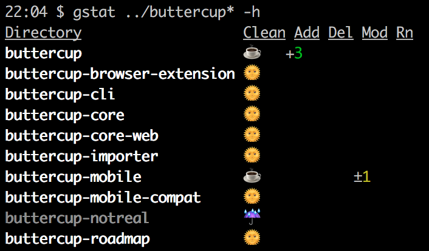

# gstat
Git repo stats reporter application for the terminal

[](https://www.npmjs.com/package/gstat)

## Installation
Install `gstat` globally:

```shell
npm install -g gstat
```

## Usage
`gstat` takes a directory or glob of directories:

```shell
gstat /somedir
# or
gstat ~/git/*
```

### Options
Certain flags can be added to the command:

 * `-w`: Watch the listed directories for changes every 5 seconds
 * `--watch=n`: Watch the listed directories for changes every **n** seconds
 * `-h`: Show headings

## Output
`gstat` outputs a list of matched directories and their statuses:


